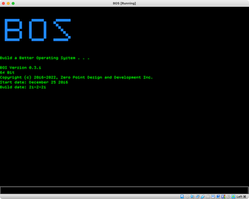

# BORSAT OS
Better Original System and Technology (BOS)

That first sentence says it all. The intent of this project is: if you were to create a brand new Operating System (OS) from scratch with no code re-use, what would you do to make it better? What would you put in? And just as important, what would you leave out? 

## What makes BOS unique:
BOS is a stripped down, 64 bit, pre-emptive multi-tasking OS to allow developers to create applications without having to deal with complexities of an OS or platform you are using. To make it as easy to bring your application or system to life.

- It is built from scratch. No libraries where used. All hardware drivers are written from scratch.
- It is small; leaving resources for the application. 
- It is fast; BOS will startup in a few seconds (even from a USB stick). 
- It is a platform to create purpose specific applications; giving the developer an ability to setup an environment that does what the developer wants without having to lock down an OS or remove un-needed functions from the OS.
- Full transparency, everything is shown.
- All resources are at the developers disposal.

## What BOS is not:
It is not a general purpose OS. It is not meant for people to read emails, browse the Internet, create documents, create presentations, etc. There are other OS' that do this and do this very well. 

BOS is meant to be the base platform for a product or project. BOS would be a great solution for Internet of Things (IoT) as many of those products are meant to deliver very specific tasks. Any solution that is meant to deliver specifics results, BOS would be the platform to use.

## The Goal
This project is very new and raw. The intent at this time is to allow people to try out the OS, create new applications and, provide constructive feedback that will be used to improve the OS.

I will continously be posting sample code, tutorials and updates; check back frequently for changes.

Send feedback and inquiries to zpdd.inc@gmail.com

## Getting Started
To get started refer to the following in the documents folder:
* The BOS Setup guide; to get BOS running.
* The BOS User guide; to understand how BOS works.
* The BOS Programming guide; to create user programs.

In addition, refer to the sample source code in the source examples folder.

## Updates
* May 21, 2021:
  * Added new C libraries; sound blaster 16, PC speaker
  * Updated current libraries; lib_bos
  * Updated Makefiles and provided examples
  * QEMU; added a script file to run BOS within QEMU
* Apr 21, 2021: Cross Compiler for BOS (BCC) and a sampe TCP Listener program using BCC.
* Apr 21, 2021: Updated BOS image to v3.2
* Apr 8, 2021: Support for user programs written in C.

Made in Canada.\

